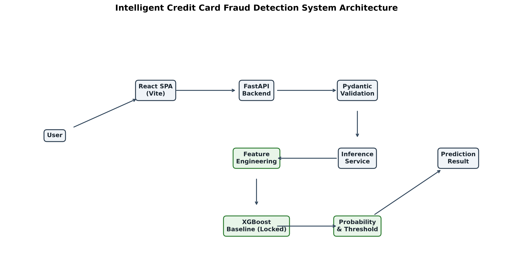

# Intelligent Credit Card Fraud Detection System

## Overview
Built an end-to-end credit card fraud detection platform using leakage-safe preprocessing, Logistic Regression and XGBoost baselines, validation-based threshold selection, isolated unseen-test evaluation, FastAPI model serving, React visualization, and automated API/browser testing.

## Problem Statement
Credit card fraud detection is highly challenging due to extreme class imbalance (typically <0.2% of transactions are fraud). The financial cost of a missed fraudulent transaction (False Negative) is usually significantly higher than the operational cost of an incorrectly flagged legitimate transaction (False Positive). Therefore, optimizing standard accuracy is meaningless; a model must be designed to balance **Precision** and **Recall**, explicitly tuning its classification threshold to align with business requirements.

## Key Results
The final XGBoost model was evaluated on a completely **unseen test set** (42,559 transactions, 71 fraud cases).
- **Recall (Fraud Captured)**: 81.69% (Exceeded >=80% business constraint)
- **Precision**: 76.32%
- **PR-AUC**: 0.8111
- **ROC-AUC**: 0.9653
- **Accuracy**: 99.93%

The model successfully caught 58 out of 71 fraud cases while only raising 18 false alarms out of 42,488 legitimate transactions on the unseen test set.

## System Architecture
The application runs as a decoupled system ensuring strict separation of concerns.



## Machine Learning Pipeline
The ML pipeline was developed iteratively:
1. **Raw Dataset**: Highly imbalanced, with anonymized PCA features (V1-V28), Time, and Amount.
2. **Data Understanding & Cleaning**: Strict removal of duplicates, invalid strings, and handling missing values.
3. **Leakage-Safe Split**: A deterministic 70/15/15 train/validation/test split.
4. **Feature Engineering**: Transforming raw Time and Amount into cyclic features (`time_of_day_sin/cos`) and scaled metrics (`amount_log1p`).
5. **Model Baselines**: Establishing Logistic Regression and XGBoost benchmarks.
6. **Hyperparameter Optimization**: Systematic CV tuning on the training set.
7. **Threshold Analysis**: Aligning probability boundaries with business costs using the validation set.
8. **Final Unseen-Test Evaluation**: The ultimate proof of generalization on the untouched test set.

**Crucially, the test set was fully isolated and never used for training, model selection, or threshold tuning.**

## Model Development

### Logistic Regression Baseline
Established as an interpretability benchmark using `class_weight="balanced"`. It suffered from extreme False Positives:
- **Validation PR-AUC**: 0.6999
- **Validation ROC-AUC**: 0.9658

### XGBoost Baseline
Switched to a non-linear tree-based architecture, scaling positive weights natively without artificial data synthesis (e.g., SMOTE):
- **Validation PR-AUC**: 0.8437
- **Validation ROC-AUC**: 0.9726

### Hyperparameter Optimization
A randomized search with 3-fold CV was conducted to optimize XGBoost. The default baseline achieved a slightly higher PR-AUC than the optimized configuration (0.8437 vs 0.8370), so the baseline was retained.

### Threshold Analysis
The default threshold (0.50) was sub-optimal for the business constraint of **Recall >= 80%**. By analyzing validation trade-off curves, the threshold was lowered to **0.31**, ensuring high capture rates while retaining maximum possible precision (81.43% on validation).
- Lower threshold → more transactions flagged → fewer false negatives → potentially more false positives.

### Final Unseen-Test Evaluation
The Phase 4 XGBoost Baseline, locked with the 0.31 threshold, was evaluated precisely once against the isolated `test.csv`. The results (81.69% Recall, 76.32% Precision) proved the model generalized excellently without data leakage.

## Application Architecture

### FastAPI Model Serving
- Validates 30-feature vector requests natively via Pydantic.
- Securely loads the final locked `models/final_model_config.json` model once into the app state (`lifespan`).
- Runs inference and explicitly applies the locked threshold before returning probabilities.
- [Detailed API Docs](docs/api.md)

### React Dashboard
- Built with React 18 and Vite.
- Vanilla CSS providing a premium fintech aesthetic.
- Provides immediate user feedback with built-in numeric validation to prevent obvious invalid payloads.
- [Detailed Frontend Docs](docs/frontend.md)

## Testing & Verification
The system is rigorously tested across all layers.
- **Backend (52 tests)**: Covers data cleaning, preprocessing, models, threshold behavior, API contracts, and E2E endpoints.
- **Frontend (6 tests)**: Component logic, client-side validation, and API mocking via Vitest.
- **E2E Integration**: Python subprocess spawns the FastAPI server, connects an automated Playwright Chromium browser instance, submits a synthetic transaction, and verifies the exact UI render result.

## Project Structure
```text
backend/
├── app/
│   ├── api/
│   ├── core/
│   ├── ml/          # Feature engineering, ML lifecycle
│   ├── schemas/     # Pydantic validation
│   └── services/    # Inference services
├── tests/
└── requirements.txt

frontend/
├── src/
│   ├── api/
│   ├── components/
│   ├── styles/
│   └── __tests__/
├── e2e/             # Playwright browser tests
└── package.json

docs/                # Extensive technical markdown logs
```

## Installation
Clone the repository and initialize the environments:

**Backend (Python)**
```bash
python -m venv .venv
.\.venv\Scripts\Activate.ps1
pip install -r backend/requirements.txt
```

**Frontend (Node)**
```bash
cd frontend
npm install
```

## Environment Configuration
The system uses isolated `.env` handling:
- **Frontend**: Expects `VITE_API_BASE_URL` (default: http://127.0.0.1:8000)
- **Backend**: Can parse `BACKEND_CORS_ORIGINS` to securely manage browser access.

*Never expose `.env` secrets.*

## Running Locally

**Start Backend Server**
```bash
uvicorn backend.app.main:app --reload
```

**Start Frontend Development Server**
```bash
cd frontend
npm run dev
```

**Run Backend Tests & E2E**
```bash
.venv\Scripts\python -m pytest backend/tests/
```

**Run Frontend Tests**
```bash
cd frontend
npm run test
```

## Security & Engineering Practices
The application enforces strict software engineering standards rather than functioning merely as an ML notebook:
- **Pydantic Validation**: Automatically rejects malformed payloads and invalid types.
- **NaN/Infinity Rejection**: Custom validators prevent corrupted numeric bounds (Infinity) from poisoning ML inference.
- **Controlled Exceptions**: Unhandled ML errors are logged on the server and safely translated to HTTP 500 without leaking stack traces.
- **Environment-based CORS**: Strictly binds access policies instead of wildcard defaults.
- **Test-Set Isolation**: Enforced mathematically and behaviorally across the repository.
- **Browser E2E Testing**: Real Playwright integration traversing the full stack.

## Limitations
- Features (V1-V28) are anonymized PCA variables, preventing real-world domain engineering.
- Threshold selection (0.31) was chosen based on illustrative business metrics (>=80% Recall) rather than a proprietary bank cost matrix.
- Integration test relies on a synthetic fixture; production would require real-time streaming constraints.

## Future Improvements
- **Concept Drift Monitoring**: Monitor prediction distributions over time for model decay.
- **Production Observability**: Add Prometheus/Grafana metrics to the FastAPI layer.
- **Authentication/Authorization**: Add robust user auth (JWT/OAuth) before public exposure.
- **Rate Limiting**: Defend against automated transaction brute-forcing.

## Author
[Intelligent Credit Card Fraud Detection System Maintainer]
