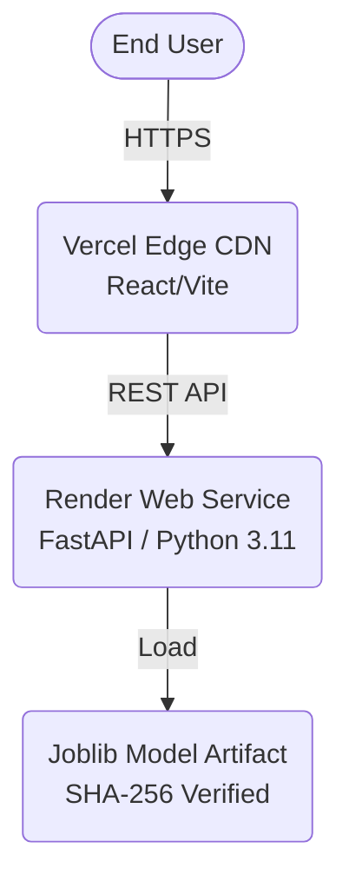

# Production Deployment Architecture

This document describes the Phase 12 deployment architecture for the Intelligent Credit Card Fraud Detection System.

## Architecture Overview
The application is deployed across two specialized hosting platforms to separate the frontend serving from the backend ML inference workload.

1. **Frontend**: Deployed on **Vercel** as a statically built React SPA.
2. **Backend**: Deployed on **Render** as a Python Web Service.



## Model Artifact Strategy
To ensure 100% deterministic, reproducible, and failsafe deployments, the locked ML model artifact is versioned directly in the repository.

- **Files Kept**:
  - `models/xgboost_baseline.joblib` (614 KB)
  - `models/final_model_config.json`
- **Why?**: The model is tiny (under 1 MB), contains no sensitive data, and avoids the complexity and failure risks associated with external S3/AWS downloads during deployment.
- **Security / Integrity**: A strict cryptographic SHA-256 hash (`9a90a60b5372045036ce107bedd343c4d42e2e9210c6f92f5fe4a853ba22958e`) is embedded in the configuration. The FastAPI `lifespan` recalculates this hash dynamically on startup. If the artifact has been corrupted or maliciously altered, the API refuses to load the model.

## Backend Deployment (Render)
- **Infrastructure-as-Code**: Managed via `render.yaml`.
- **Python Version**: Hardcoded to `3.11.4` (A stable, modern Python 3.11 environment compatible with the ecosystem).
- **Start Command**: `uvicorn backend.app.main:app --host 0.0.0.0 --port $PORT`
- **Environment Variables**:
  - `BACKEND_CORS_ORIGINS`: Set to the explicit Vercel frontend URL. No wildcard CORS is allowed.

## Frontend Deployment (Vercel)
- **Configuration**: Vercel automatically detects the Vite framework and executes `npm run build`, serving the `dist/` directory.
- **Client-Side Routing**: The application is a strict single-page view without `react-router` paths, meaning no `vercel.json` URL-rewriting is necessary.
- **Environment Variables**:
  - `VITE_API_BASE_URL`: Set to the Render backend URL.

## API Contract
The verified production endpoints are strictly:
- `GET /api/v1/health`
- `POST /api/v1/predict`

## Testing the Deployment
Once deployed, the integration can be verified using the automated E2E script by targeting the live URLs instead of localhost:
```bash
npx playwright test
```
