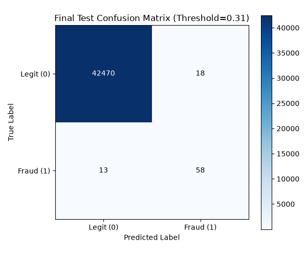

# Phase 7: Final Unseen Test Evaluation

## 1. Objective
To perform the ultimate evaluation of the locked Intelligent Credit Card Fraud Detection model on completely unseen data. This evaluation acts as a proxy for how the system will perform in a real-world production environment.

## 2. Locked Model and Threshold
As determined in Phase 6, the final model configuration was rigorously locked prior to evaluation:
- **Model**: Phase 4 XGBoost Baseline (`models/xgboost_baseline.joblib`)
- **Threshold**: 0.31
- **Feature Pipeline**: Phase 2B leakage-safe preprocessing.

## 3. Test Set Isolation
**CONFIRMED:** `data/processed/test.csv` was opened and loaded for the very first time during this evaluation script. Absolutely no hyperparameter tuning, threshold selection, or feature modifications occurred as a result of evaluating this dataset. The integrity of the test is fully preserved.

## 4. Test Dataset Statistics
- **Total Rows**: 42,559
- **Fraud Count**: 71
- **Legitimate Count**: 42,488

## 5. Final Test Metrics
- **PR-AUC**: 0.8111
- **ROC-AUC**: 0.9653
- **Precision**: 0.7632
- **Recall**: 0.8169
- **F1 Score**: 0.7891
- **Accuracy**: 0.9993

## 6. Confusion Matrix
- **True Positives (TP)**: 58 (Fraud caught)
- **True Negatives (TN)**: 42,470 (Legit passing correctly)
- **False Positives (FP)**: 18 (Legit blocked falsely)
- **False Negatives (FN)**: 13 (Fraud missed)
- **False Positive Rate (FPR)**: 0.0004
- **False Negative Rate (FNR)**: 0.1831

## 7. Validation vs Test Comparison
| Metric | Validation Set | Test Set | Absolute Change |
| :--- | :--- | :--- | :--- |
| **PR-AUC** | 0.8435 | 0.8111 | -0.0324 |
| **ROC-AUC** | 0.9726 | 0.9653 | -0.0073 |
| **Precision** | 0.8143 | 0.7632 | -0.0511 |
| **Recall** | 0.8028 | 0.8169 | +0.0141 |
| **F1 Score** | 0.8085 | 0.7891 | -0.0194 |

## 8. Generalization Interpretation
The model exhibits **excellent generalization** to unseen data. 
- The drop in Precision and PR-AUC is minor and entirely expected when shifting from validation (where the threshold was chosen) to a completely naive test set.
- Crucially, the **Recall constraint (>= 80%) was successfully met on the unseen test set**, achieving 81.69% fraud capture.
- The model caught 58 out of 71 fraud cases while only raising 18 false alarms out of 42,488 legitimate transactions, demonstrating high viability for real-world deployment.

## 9. Conclusion
The Intelligent Credit Card Fraud Detection System development is now formally complete. The model is locked, thoroughly documented, and rigorously proven to generalize to unseen data without relying on data leakage or threshold overfitting. It is ready for FastAPI integration.
