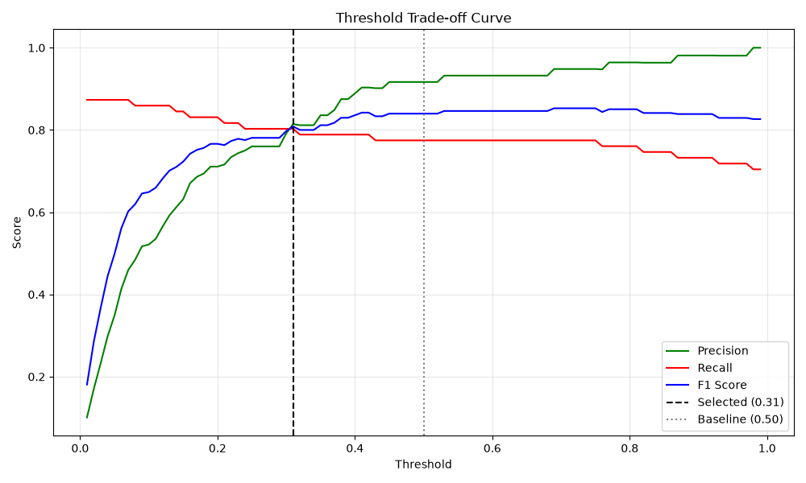
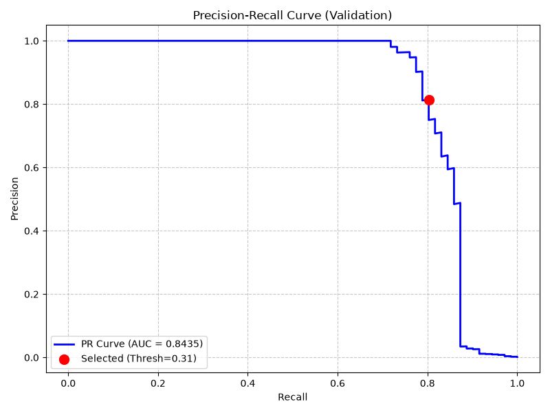
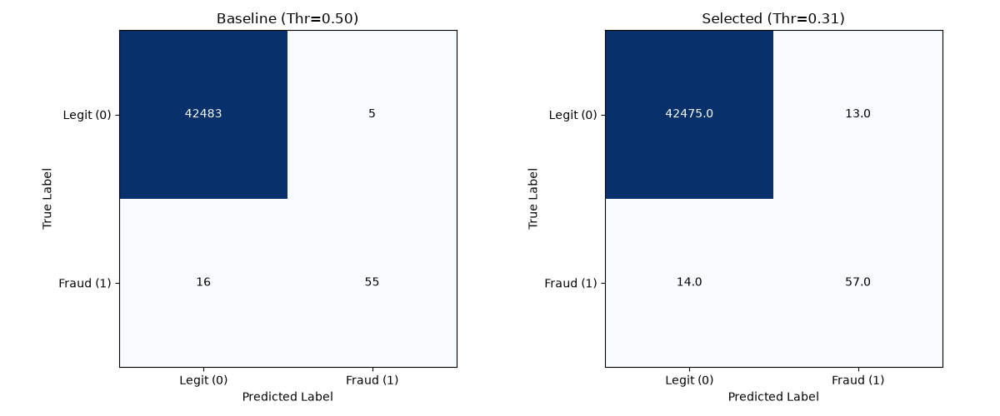

# Phase 6: Threshold Analysis & Final Model Selection

## 1. Objective
Analyze how different probability classification thresholds affect precision, recall, F1, and other key metrics. The ultimate goal is to select a defensible, business-aligned operating threshold for the final fraud-detection model based solely on validation data.

## 2. Selected Model
The **Phase 4 XGBoost Baseline** (`models/xgboost_baseline.joblib`) is locked as the final selected model. Retraining and hyperparameter optimization were deliberately avoided in this phase. The threshold analysis focuses purely on how we interpret the probabilities emitted by this locked model.

## 3. Validation Dataset
- `data/processed/validation.csv`
- Total Rows: 42,559
- Total Fraud Cases: 71

## 4. Test-Set Isolation
**CONFIRMED:** The test set (`data/processed/test.csv`) was entirely excluded from this process. It was neither loaded, inspected, nor used to evaluate thresholds, thus preserving its integrity for the ultimate final evaluation.

## 5. Why Threshold Analysis is Necessary
Machine learning models output probabilities between 0 and 1. The default threshold of 0.50 is arbitrary and rarely optimal for heavily imbalanced datasets where the costs of False Positives (customer friction) and False Negatives (fraud loss) differ dramatically.

## 6. Baseline 0.50 Threshold Performance
- **Precision:** 0.9167
- **Recall:** 0.7746
- **F1 Score:** 0.8397
- **False Positives (FP):** 5
- **False Negatives (FN):** 16

## 7. Threshold Search Range
We evaluated a dense array of exactly 99 candidate thresholds from `0.01` to `0.99` in `0.01` increments, using the validation probabilities.

## 8. Precision/Recall Trade-off
As the threshold is lowered, the model catches more fraud (Recall increases) but flags more legitimate transactions (Precision decreases).

## 9. F1-Maximizing Threshold
- **Threshold:** 0.69

## 10. Precision-Maximizing Threshold
- **Threshold:** 0.98

## 11. Recall-Maximizing Threshold
- **Threshold:** 0.01

## 12. Approximately 80%-Recall Candidate
- **Threshold:** 0.24 (Closest absolute difference to 0.80 recall without exceeding precision constraint logic).

## 13. Final Threshold Selection Rule
The agreed-upon business assumption dictates:
1. **Primary Constraint:** Recall >= 80% (Capture at least 80% of actual fraud).
2. **Secondary Objective:** Among those candidates, maximize Precision to reduce false alarms.

## 14. Selected Threshold
- **Selected Threshold:** `0.31`

This was the highest threshold that still mathematically satisfied `Recall >= 0.80` while retaining the highest possible precision in that bracket.

## 15. Final Validation Metrics (at Threshold 0.31)
- **Precision:** 0.8143
- **Recall:** 0.8028
- **F1 Score:** 0.8085
- **Accuracy:** 0.9994
- **True Positives (TP):** 57
- **True Negatives (TN):** 42,475
- **False Positives (FP):** 13
- **False Negatives (FN):** 14
- **FPR:** 0.0003
- **FNR:** 0.1972

## 16. Baseline vs Final Threshold Comparison
| Metric | Threshold 0.50 (Baseline) | Threshold 0.31 (Selected) |
| :--- | :--- | :--- |
| **Precision** | **0.9167** | 0.8143 |
| **Recall** | 0.7746 | **0.8028** |
| **F1** | **0.8397** | 0.8085 |
| **Accuracy** | **0.9995** | 0.9994 |
| **TN** | **42,483** | 42,475 |
| **FP** | **5** | 13 |
| **FN** | 16 | **14** |
| **TP** | 55 | **57** |
| **FPR** | **0.0001** | 0.0003 |
| **FNR** | 0.2254 | **0.1972** |
| **PR-AUC** | 0.8435 | 0.8435 |
| **ROC-AUC**| 0.9726 | 0.9726 |

## 17. False-Positive Interpretation
A **False Positive (FP)** occurs when a legitimate transaction is incorrectly flagged as fraud. This causes customer friction (e.g., a declined card at a checkout) and incurs operational costs (call center volume to resolve the block). By lowering the threshold to 0.31, FPs increased from 5 to 13.

## 18. False-Negative Interpretation
A **False Negative (FN)** occurs when a fraudulent transaction goes undetected. This results in direct financial loss (chargebacks) and regulatory/reputational damage. By lowering the threshold to 0.31, FNs were reduced from 16 to 14.

## 19. Business Assumptions
This project used `Recall >= 0.80` as an illustrative operating assumption. A real financial institution must calculate the precise dollar cost of an FN (fraud loss) versus the cost of an FP (customer churn, support cost) to dynamically set this threshold.

## 20. Limitations
- The validation set has only 71 fraud cases. This small sample size means that threshold tuning can be noisy (e.g., shifting the threshold slightly only changes a few transactions).
- The assumption `Recall >= 0.80` was defined without empirical cost-benefit data from a specific bank.

## 21. Why PR-AUC/ROC-AUC Remain Unchanged
Metrics like Precision, Recall, and F1 are derived from "hard" classifications (0 or 1), which require a threshold. PR-AUC and ROC-AUC are calculated by integrating across *all possible thresholds* using the raw probabilities. Therefore, altering the chosen operating threshold has absolutely zero impact on the AUC metrics.

## 22. Test-Set Isolation
The test set (`data/processed/test.csv`) remains pristine and isolated.

## 23. Final Model-Lock Decision
- **Final Model Artifact:** `models/xgboost_baseline.joblib`
- **Deployment Config:** `models/final_model_config.json`
- **Selected Threshold:** `0.31`

## 24. Next Phase
Phase 7 will involve the final evaluation of the locked model and threshold configuration against the untouched test set.
