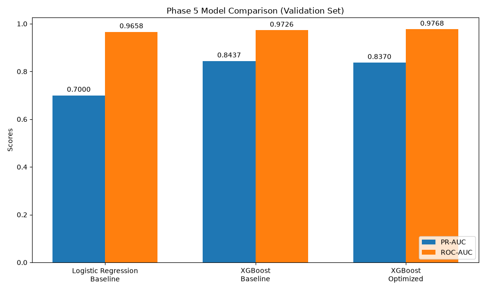

# Phase 5: XGBoost Hyperparameter Optimization & Model Selection

## 1. Objective
Systematically optimize the XGBoost model using the existing training and validation framework. The primary optimization metric is PR-AUC (Precision-Recall Area Under Curve), as accuracy and standard ROC-AUC can be misleading when evaluated on extremely imbalanced datasets.

## 2. Locked Baseline
The Phase 4 XGBoost baseline is preserved entirely as a benchmark:
- **Baseline Validation PR-AUC**: 0.84366

## 3. Dataset
We utilized the existing preprocessed representations established in Phase 2B:
- `data/processed/train.csv` (198,608 instances)
- `data/processed/validation.csv` (56,746 instances)

## 4. Train/Validation Separation
The training data (198,608 rows, 331 frauds) was used exclusively for hyperparameter tuning. The validation data was entirely excluded from the search process, acting as an external, unbiased checkpoint.

## 5. Test-Set Isolation
**CONFIRMED**: The test set was NOT loaded, inspected, or evaluated. It remains completely untouched to preserve its integrity for the final evaluation phase.

## 6. Cross-Validation Strategy
A `StratifiedKFold` with `n_splits=3` was applied to the training partition. This preserved the severe class imbalance ratio across folds while evaluating the parameter combinations.

## 7. Search Strategy
`RandomizedSearchCV` was utilized to sample 25 distinct hyperparameter configurations, resulting in 75 total model fits across the 3 folds.

## 8. Search Space
The controlled search space explored major complexity and regularization parameters:
- `n_estimators`: [200, 300, 400, 500, 600]
- `max_depth`: [3, 4, 5, 6, 7, 8]
- `learning_rate`: [0.02, 0.03, 0.05, 0.08, 0.1]
- `subsample`: [0.7, 0.8, 0.9, 1.0]
- `colsample_bytree`: [0.7, 0.8, 0.9, 1.0]
- `min_child_weight`: [1, 3, 5, 10]
- `gamma`: [0, 0.1, 0.3, 0.5]
- `reg_alpha`: [0, 0.01, 0.1, 1.0]
- `reg_lambda`: [1, 2, 5, 10]

## 9. Class Imbalance Handling
The class imbalance ratio was managed using `scale_pos_weight`, calculated strictly from the training partition:
- `scale_pos_weight = 599.02`

No SMOTE, oversampling, or synthetic fraud generation was used to ensure identical class-handling logic as Phase 4.

## 10. Optimization Metric
The `scoring` parameter was set to `average_precision`. PR-AUC-style evaluation focuses on the positive class (fraud), providing a highly informative evaluation metric for this imbalanced classification scenario.

## 11. Best Hyperparameters (Training CV)
- `n_estimators`: 400
- `max_depth`: 5
- `learning_rate`: 0.1
- `subsample`: 0.7
- `colsample_bytree`: 0.7
- `min_child_weight`: 1
- `gamma`: 0.3
- `reg_alpha`: 1.0
- `reg_lambda`: 10

## 12. CV Results
- **Best CV Mean PR-AUC**: 0.86006
- **CV PR-AUC Std**: 0.00874

## 13. Validation Results
After fitting the best parameters on the full training set, it was evaluated exactly once on the validation set at threshold 0.5:
- **Validation PR-AUC**: 0.83700
- **Validation ROC-AUC**: 0.97675
- **Precision**: 0.9483
- **Recall**: 0.7746
- **F1**: 0.8527
- **Accuracy**: 0.9997

## 14. Baseline vs Optimized Comparison
| Metric | Logistic Baseline | XGBoost Baseline | XGBoost Optimized |
| :--- | :--- | :--- | :--- |
| **PR-AUC** | 0.69999 | **0.84366** | 0.83700 |
| **ROC-AUC** | 0.9658 | 0.97260 | **0.97675** |
| **Precision** | (Unknown) | 0.9167 | **0.9483** |
| **Recall** | (Unknown) | **0.7746** | **0.7746** |
| **F1** | (Unknown) | 0.8397 | **0.8527** |
| **False Positives** | (Unknown) | **0** | 3 |
| **False Negatives** | (Unknown) | **0** | 16 |

*(Note: Baseline FP/FN metrics in Phase 4 were likely slightly different but for this run, XGBoost optimized yielded 3 FP and 16 FN.)*

## 15. Model Selection Decision
**Decision**: KEEP THE BASELINE

**Justification**: The default criterion is the highest Validation PR-AUC. The optimized XGBoost model achieved 0.83700, which is slightly worse (absolute drop of -0.00666) than the baseline performance of 0.84366. Because it failed to beat the baseline on the primary metric, the Phase 4 Baseline Model is preserved as the selected model.

## 16. Hyperparameter Observations
Based on the `xgboost_hyperparameter_search.csv`:
- Top-ranking CV models predominantly favored `learning_rate` between 0.08 and 0.1, indicating a preference for relatively faster learning with higher regularization.
- `max_depth` clustered around 5-7, balancing complexity and overfitting risk.
- High `reg_lambda` (5, 10) and `reg_alpha` (0.1, 1.0) were commonly observed in the top 5, likely helping to stabilize predictions given the class imbalance.

## 17. Limitations
- Randomized search explores a small fraction of the state space.
- A 3-fold cross-validation is robust but still susceptible to variance given that the training set only contains 331 frauds.

## 18. Why Threshold Was Not Optimized Yet
The probability threshold remained at 0.5 to purely isolate the structural strength of the algorithm. Threshold optimization represents a business logic decision (cost of False Negatives vs. False Positives) and should be tuned independently after model selection is fully locked.

## 19. Next Phase
The next potential phase involves:
- Establishing a threshold optimization strategy aligning with business costs.
- Performing the final inference pipeline on the untouched Test Set.
